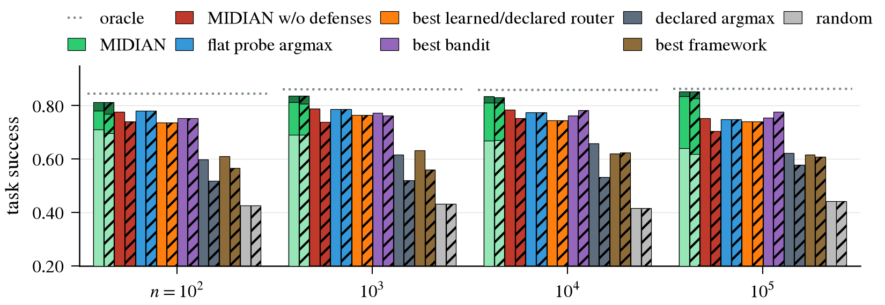

# MIDIAN: routing tasks to the right agent when some agents lie

Anonymous Authors

[Paper (OpenReview)](https://openreview.net/forum?id=ANONYMOUS) · [BibTeX](#citation) · [Documentation](docs/) ·
 

<p align="center">
   <!-- VERIFY-PATH -->
</p>
<p align="center"><sub>Task success on the live LLM population (specialist, n = 10<sup>2</sup> to 10<sup>5</sup>). Solid: honest
population; hatched: β = 0.5 low-skill-first cartel. On MIDIAN the light / mid / dark bars are the probe budget b = 1 / 3 / 5.</sub></p>

Given n agents of unknown skill that describe themselves, some of them dishonestly, how do you send each incoming task to
an agent that can solve it, and what does that cost? This repository is the benchmark behind the paper: a world of n
agents whose true skill is hidden from every method, four channels a method must declare and pay for (self-declarations,
probes, peer reports, messages), and three backends (live LLM agents, recorded router-benchmark outcomes, calibrated
synthetic populations) up to n = 10<sup>7</sup>. It compares **MIDIAN**, a hierarchical, peer-verified routing tree, with
flat probing, bandits, learned routers, declaration readers and the selection primitives of ten agent frameworks, all
paired on the same agents, liars and task streams and charged for every probe, report, message and comparison.

On the live population at n = 1,000 (b = 3, 10 seeds), MIDIAN routes correctly 0.81 of the time in the honest population
and 0.81 under a β = 0.5 low-skill cartel; the best of the ten frameworks on its best text shortlist reaches 0.63 / 0.56,
declared argmax 0.62 / 0.52, a flat probe scan 0.79 / 0.79 and random 0.43. At n = 10<sup>5</sup> MIDIAN holds 0.84 / 0.83
while its routing work grows from 36 to 58 messages plus comparisons per query (80 at 10<sup>7</sup>); any flat scan
compares all n agents. Numbers are read from `figures/paper/A_live_stacked.csv` and `C_routing_work_vs_n.csv`.
<!-- VERIFY-PATH -->

## Installation

Python 3.12 or newer. The core (the world, every non-LLM method, the analysis) needs only numpy, pandas, scipy and PyYAML;
the rest is in extras.

```bash
git clone <this repository> midian && cd midian
pip install -e ".[figures,test]"     # CPU quickstart, figures and tests
pip install -e ".[all]"              # + learned routers (torch, sentence-transformers, ...) and the LLM client
pip install -r requirements.txt -e . # the exact versions every reported number was produced with
```

| extra | adds | needed for |
|---|---|---|
| `learned` | torch, sentence-transformers, scikit-learn, hnswlib, trueskill | kNN / MLP / NSW routers, TrueSkill, dense shortlists |
| `llm` | openai, reasoning-gym, requests, huggingface_hub | the live backend and the framework adapters (plus a served model fleet) |
| `figures` | matplotlib | redrawing the figures |
| `test`, `dev` | pytest; ruff | the test suite; linting (line length 120) |

Each agent framework runs in its own virtual environment, built from `requirements-frameworks/<framework>.txt`; see
[docs/operations.md](docs/operations.md).

## Data

Everything the code reads or writes outside the repository lives under one directory, `$RTE_DATA` (results, the LLM
answer memo, populations, downloaded datasets, model weights, environments). Set it before running anything:

```bash
export RTE_DATA=$PWD/rte_data
```

The CPU quickstart and the bernoulli grids need no data. The other backends read third-party data that is not
redistributed here (see [NOTICE](NOTICE)); download scripts are in `scripts/data/` <!-- VERIFY-PATH -->:

| backend | source | location under `$RTE_DATA` |
|---|---|---|
| replay | RouterBench (Hu et al., 2024), 0-shot outcomes of 11 models | `data/routerbench_cells.npz` |
| routereval | RouterEval (Huang et al., 2025) pools of 10 to 5,000 LLMs; LLMRouterBench (Li et al., 2026) | `data/routereval/router_dataset/` |
| llm (live) | Reasoning Gym task families; Qwen2.5 0.5B-14B and Gemma-2 2B/9B weights | `hf_cache/`, `populations/` |

The stored result rows behind the paper (4.5 M method rows over 197 grids) are not part of the repository; the figure
inputs are, as aggregate CSVs (see [Reproducing the paper](#reproducing-the-paper)).

## Quickstart

On a laptop CPU, in about a minute (no data files, no GPU):

```bash
pytest -q                                          # ~400 tests, ~2 min (slow and fleet tests deselected)
python -m rte.run --grid reviewer_bernoulli        # MIDIAN, its three ablations and four rivals, honest and cartel: 180 rows, ~15 s
python -m rte.analyze --grid reviewer_bernoulli    # tables, paired deltas, cost exponents -> summary.md, ~15 s
```

`reviewer_bernoulli` runs MIDIAN, MIDIAN w/o verification, MIDIAN w/o audits, MIDIAN w/o defenses, declared argmax,
flat probe argmax, the warm-start bandit and random on the synthetic backend at n = 10<sup>2</sup> and 10<sup>3</sup>,
honest and under the β = 0.5 low-skill cartel, 5 seeds. Results land in `$RTE_DATA/results/reviewer_bernoulli/`
(see [Outputs](#outputs)). Then, in increasing cost:

<!-- VERIFY-PATH: scripts/figures/make_all.py (lane C) -->
```bash
python scripts/figures/make_all.py --from-csv                   # redraw every paper figure from the shipped CSVs
python -m rte.run --grid smoke                                  # every method on a small synthetic world
python -m rte.run --grid live_f1_n1000 --only dist=specialist   # a live grid: needs the model fleet (docs/operations.md)
```

A method is one file in `rte/methods/`, and [docs/architecture.md](docs/architecture.md) shows the interface.

## Reproducing the paper

[docs/reproducing.md](docs/reproducing.md) has the four tiers (redraw from CSVs; aggregates from rows; CPU grids; live
LLM fleet). The figures and the commands that draw them:

| paper figure | file in `figures/paper/` | command | input |
|---|---|---|---|
| Fig. 1 | `A_live_stacked` | `python scripts/figures/condensed_figs.py` | `results/aggregates/bars/*.csv`, rows of `va_b_*`, `rivals_b_*`, pool grids |
| Fig. 2 | `B_families_stacked` | same | same, plus the erratum-30 grids of the four non-live families |
| Fig. 3 | `F_shortlists_1e5` | `python scripts/figures/shortlist_condensed.py` | `results/aggregates/shortlist/live.csv` |
| Fig. 4 | `H_routereval_shortlists` | same | `results/aggregates/shortlist/routereval.csv` |
| Fig. 5 | `D_energy_per_query` | `python scripts/figures/efficiency_figs.py` | `cost_by_n.csv` (ledger of `bernoulli_scale_v5`), the energy model |
| App. | `A_live_allb`, `B_families_allb` | `condensed_figs.py` | as Figs. 1-2 |
| App. | `C_routing_work_vs_n` | `efficiency_figs.py` | as Fig. 5 |
| App. | `E_shortlists_by_n`, `F_shortlists_1e5_appendix`, `G_shortlist_lift_1e5` | `shortlist_condensed.py` | as Fig. 3 |
| App. | `I_max_lie` | `python scripts/figures/lie_max_fig.py` | rows of `lie_max_*`, `lie_max_fw_*` |

<!-- VERIFY-PATH: script locations under scripts/figures/ and the aggregates under results/aggregates/ -->
`python scripts/figures/make_all.py` runs all of them; with `--from-csv` it redraws from the CSV written beside each figure
and needs no result rows. Every plotted value, its grids, cells, seeds and aggregation are traced in
[docs/figure_provenance.md](docs/figure_provenance.md); [docs/figures.md](docs/figures.md) has the style rules and the
figure-to-grid table.

## Repository structure

<!-- VERIFY-PATH: tree follows the refactor plan's target layout -->
```
rte/                    the benchmark package
  world.py              World and View: hidden skill S, declarations D, liars, channels, paired task streams
  ledger.py             the six cost counters, one increment site each
  budget.py             the probe budget: b probes per (agent, family)
  run.py                grid runner: cells x seeds x methods -> one row per result; resumable, shardable
  config.py             $RTE_DATA and every RTE_* switch, in one place
  analysis/             tables, bootstrap CIs, paired deltas, cost exponents (python -m rte.analyze)
  llm_client.py         client for the served models: endpoint choice, content-hash memo
  backends/             bernoulli (synthetic), replay (RouterBench), routereval (RouterEval, LLMRouterBench), llm (live)
  methods/              one file per method (MIDIAN, rivals, bandits, learned routers); discovered by file name
    frameworks/         the shared framework adapter, the subprocess bridge, fw_*.py, workers/ (one per framework)
configs/
  grids/*.yaml          every experiment as a named grid (python -m rte.run --grid <name>)
  models.yaml           the live model ladder
scripts/
  setup/                environment and framework-venv builds
  data/                 dataset and model downloads, population embedding
  figures/              one script per paper figure, the shared style (figspec.py), make_all.py
  analysis/             tables and diagnostics over stored rows
  checks/               invariants: grid fingerprints, row ids, parity, anonymity
results/aggregates/     the CSV inputs of the figures (bars/, shortlist/)
figures/paper/          the paper figures: .pdf, .png and the .csv of every plotted value
tests/                  530 tests: method contracts, ledger, view enforcement, backends, framework adapters
docs/                   architecture, methods, design, reproducing, figures, operations, errata; archive/
paper/                  NUMBERS.json (every quoted number with grid, units, CI) and shortlist diagnostics
cluster/                SLURM job scripts and campaign tooling for one HPC cluster (not part of the anonymous export)
requirements-frameworks/  pinned requirements of each framework's virtual environment
```

## Outputs

`python -m rte.run --grid G` writes to `$RTE_DATA/results/G/`: one JSON file per result in `rows.d/` (atomic, so any job
can be killed and rerun; finished rows are skipped by id), folded into `rows.csv`. A row is one (cell, seed, method):
success, success on the last quarter of the stream, regret against the oracle, the misroute-to-liar rate, the six
ledger counters at build and per task, wall-clock, and the method's own statistics. `python -m rte.analyze --grid G`
adds `summary.md`, `aggregate.csv`, `paired_vs_midian.csv` (paired deltas against MIDIAN w/o defenses) and
`cost_exponents.csv` beside them. The row schema is in [docs/experimental_design.md](docs/experimental_design.md).

## Compute requirements

| tier | hardware | time |
|---|---|---|
| tests, quickstart, redrawing figures from CSVs | any CPU | minutes |
| bernoulli, replay, RouterEval grids | CPU, 1-16 cores per job | minutes per grid at n <= 10<sup>4</sup>; the 10<sup>6</sup>-10<sup>7</sup> scale grids are sharded over many jobs |
| live grids | a vLLM fleet serving the 7-model ladder (H100 / H200 GPUs) | a cold MIDIAN build at n = 10<sup>5</sup>, b = 3 took 16.6 h of the whole fleet |
| framework grids | the fleet plus supervisor replicas (Qwen2.5-7B) | one supervisor call per routed task; minutes to a day per unit, depending on the framework |

The campaign behind the paper used on the order of 10<sup>5</sup> CPU-hours on a shared SLURM cluster besides the GPU
fleet. Every model answer is memoised by content hash, so rerunning a stored live cell costs almost no GPU time.

## License

MIT for the code, the analysis scripts and the documents in this repository ([LICENSE](LICENSE)). Third-party data,
models and frameworks keep their own licenses ([NOTICE](NOTICE)).

## Acknowledgements

The live backend's tasks are [Reasoning Gym](https://github.com/open-thought/reasoning-gym) families, its agents are
Qwen2.5 and Gemma-2 models served with [vLLM](https://github.com/vllm-project/vllm). Recorded outcomes come from
RouterBench, RouterEval and LLMRouterBench. The framework arms run the selection primitives of LangGraph, CrewAI,
AutoGen, Magentic-One, Microsoft Agent Framework, OpenAI Agents SDK, Google ADK, LlamaIndex, smolagents and CAMEL, each
unmodified in its own environment. Dense shortlists use all-MiniLM-L6-v2, Qwen3-Embedding-8B and Qwen3-Reranker-4B.

## Citation

```bibtex
@inproceedings{anonymous2027midian,
  title     = {Anonymous ICLR 2027 submission},
  author    = {Anonymous Authors},
  booktitle = {Submitted to the International Conference on Learning Representations (ICLR)},
  year      = {2027},
  note      = {Under review}
}
```
